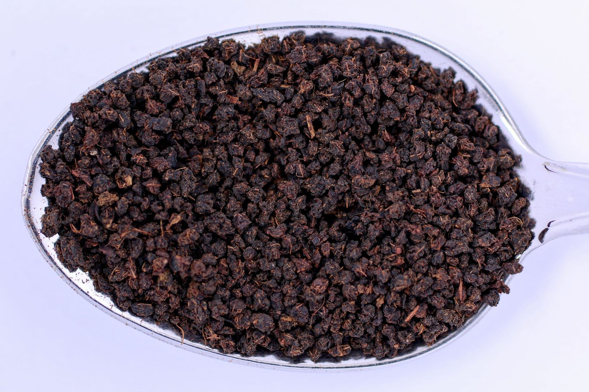

티백 홍차랑 찻잎이 통째로 든 홍차, 마셔보면 확실히 다르다고 느낀 적 있으실 거예요. 티백 쪽은 색도 진하고 맛도 빨리 우러나는데, 잎차는 은근하게 서서히 향이 올라오죠.

이 차이는 품질 차이라기보다 애초에 잎을 가공하는 방식 자체가 다르기 때문이에요. 홍차 업계에서는 이 두 방식을 각각 **CTC**와 정통(Orthodox) 제다법이라고 불러요.

CTC는 Crush(으깨기), Tear(찢기), Curl(말기)의 앞글자를 딴 이름이에요. 찻잎을 롤러 사이로 통과시켜서 잘게 부수고 찢은 다음 작고 동글동글한 알갱이 형태로 뭉치는 기계식 공정인데요, 1930년대 인도 아삼 지역에서 개발됐다고 알려져 있어요. 누가 정확히 처음 고안했는지는 자료마다 조금씩 다르게 나와서 확실히 단정하긴 어렵지만, 대량 생산이 가능한 기계식 공정이라는 점만큼은 분명해요.

*CTC 방식으로 가공된 홍차는 작고 동글동글한 알갱이 형태예요 — Photo by Marek Ruczaj on Pexels*

반대로 **정통**(Orthodox) 방식은 잎을 통째로 혹은 길게 비틀어 마는 전통적인 방식이에요. 손으로 유념(揉捻)하거나 기계를 쓰더라도 잎의 형태를 최대한 살려두는 게 핵심이죠. 다즐링이나 기문 같은 홍차들이 대표적으로 이 방식을 따르는데요, 잎이 온전한 만큼 산화 속도도 상대적으로 느리고 완만하게 진행돼요.

*정통 제다법으로 만든 홀리프 홍차는 잎 모양이 살아있어요 — Photo by Gu Ko on Pexels*

그런데 이 둘, 실제로 우려보면 얼마나 다를까요? CTC 알갱이는 표면적이 넓어서 뜨거운 물에 닿는 순간부터 성분이 빠르게 우러나요. <u>그래서 짧은 시간에도 진하고 떫은 맛이 강하게 나는 편이라, 우유를 섞어 마시는 밀크티 계열에 잘 어울려요.</u> 아삼 스타일 밀크티나 마살라 차이에 CTC 홍차가 많이 쓰이는 이유도 여기에 있어요. 반면 정통 방식으로 만든 홀리프 홍차는 우러나는 속도가 느린 만큼 층층이 향이 퍼지는 느낌이 나서, 물에 그대로 스트레이트로 마시는 쪽에 더 자주 선택되고요.

그렇다고 알갱이 형태가 곧 낮은 등급을 뜻하는 건 아니에요. 요즘은 고급 아삼 지역에서도 밀크티 시장을 겨냥해 일부러 품질 좋은 찻잎으로 CTC를 만들기도 하거든요. <u>제다 방식은 용도와 취향의 차이일 뿐, 우열을 가르는 기준은 아니에요.</u>
