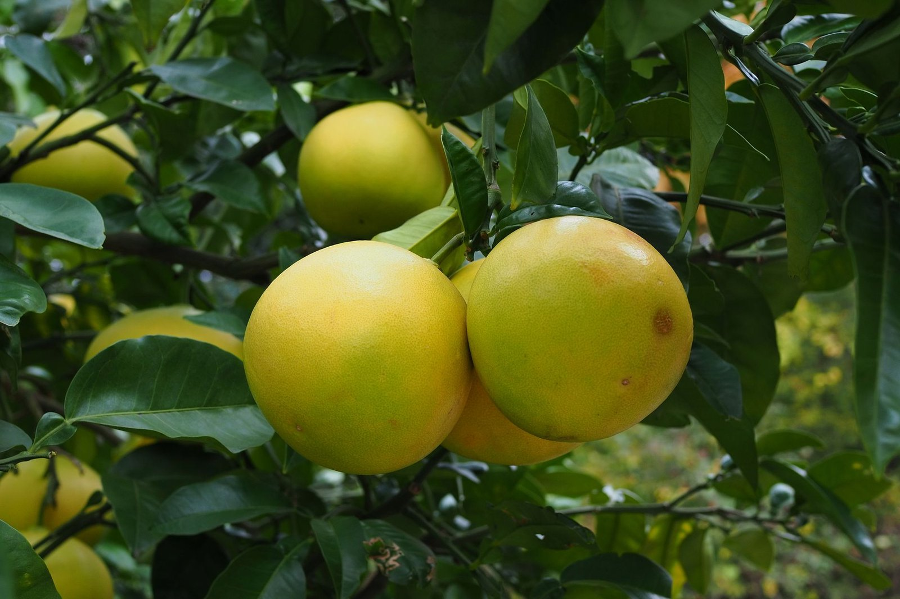

얼그레이(Earl Grey), 한 번쯤은 마셔보셨을 거예요. 그런데 얼그레이가 다즐링이나 아쌈처럼 차 산지나 품종을 가리키는 이름이라고 생각해보신 적 있으신가요? 사실 얼그레이는 <u>차 종류가 아니라 향을 입히는 방식을 가리키는 이름</u>이에요. 베이스가 되는 찻잎에 베르가못(bergamot)이라는 감귤류 열매의 향을 더한 **가향차**(加香茶)를 통틀어 얼그레이라고 부르는 거거든요.

**베르가못**(bergamot)은 오렌지도 레몬도 아닌, 이탈리아 남부 칼라브리아 지역에서 주로 재배되는 감귤류 열매예요. 과육은 시고 써서 그대로 먹기는 어렵지만, 껍질에서 짜낸 에센셜 오일은 향수 업계에서도 귀하게 쓰일 만큼 향이 진하고 화사하죠. 얼그레이 특유의 은은하게 씁쓸하면서도 산뜻한 시트러스 향은 바로 이 오일에서 나와요.

*얼그레이 향의 원료가 되는 베르가못 열매 — Photo by Lana on Pexels*

왜 하필 이름이 '얼그레이'가 됐을까요? 가장 널리 알려진 이야기는 두 가지예요.

- 19세기 영국 총리를 지낸 2대 찰스 그레이 백작(Charles Grey)이 중국에서 이 향차의 제조법을 선물로 받았다는 설
- 그레이 백작 저택의 우물물에서 나던 석회 맛을 가리려고 베르가못 향을 넣었다는 설

다만 <u>이 이야기들을 뒷받침할 만한 확실한 기록은 남아 있지 않아서</u>, 트와이닝을 비롯한 여러 차 브랜드마다 조금씩 다른 버전으로 전해질 뿐 정설로 확정된 건 아니랍니다.

얼그레이 하면 홍차를 떠올리기 쉽지만, 베이스가 꼭 홍차여야 한다는 규정은 없어요. 전통적으로는 중국 홍차 계열인 기문(Keemun) 홍차를 많이 썼지만, 요즘은 녹차나 백차, 우롱차에 베르가못 향을 입힌 얼그레이도 흔하게 찾아볼 수 있습니다. 트와이닝에서 만든 **레이디 그레이**(Lady Grey)처럼 베르가못에 시트러스 껍질이나 수레국화 꽃잎을 더한 변형 상품도 있고요.

우릴 때 기억해두면 좋은 게 하나 있어요. 베르가못 향은 오래 우릴수록 씁쓸함이 도드라지는 편이라, 홍차 베이스라면 2~3분 안쪽으로 짧게 우리는 게 향을 더 산뜻하게 즐기는 방법이에요. 시중에는 진짜 베르가못 오일 대신 합성 향료를 쓴 저가 제품도 섞여 있으니, 향이 유독 인위적으로 느껴진다면 그런 경우일 수도 있습니다.
