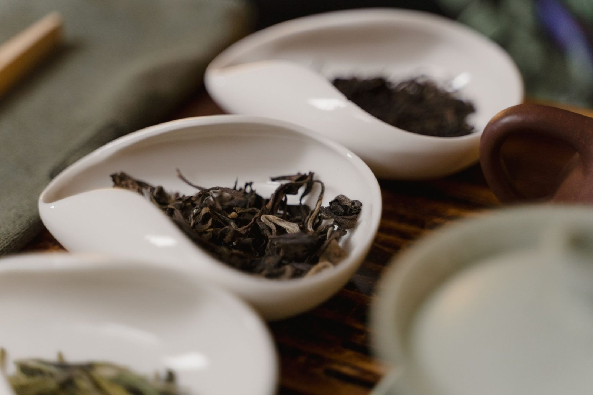

우롱차 매장에 가본 적 있으세요? 진열대에 놓인 찻잎들을 보면 색이 다 다른 걸 눈치채셨을 거예요. 어떤 건 연둣빛이 도는 초록색이고, 어떤 건 거의 홍차처럼 진한 갈색이거든요. 같은 '우롱차'라는 이름을 달고 있는데 말이죠.

이 차이를 만드는 건 **발효도(oxidation level)**예요. 정확히는 찻잎 속 효소가 공기 중 산소와 만나 색과 향을 바꾸는 산화 과정을 말하는데, 편의상 '발효'라고 부르는 경우가 많습니다. 중국 전통 6대 다류 분류에서 우롱차는 '청차(靑茶)'라는 이름으로 따로 묶이는데, 이 청차 범주 자체가 산화도 낮은 쪽부터 높은 쪽까지 폭넓게 걸쳐 있어요. 흔히 8%에서 85% 사이라고 이야기되지만, 이건 어디까지나 대략적인 범위고 제다사나 산지마다 기준이 조금씩 다릅니다. <u>녹차와 홍차 사이 어딘가에 우롱차가 있다는 설명은 틀린 말은 아니지만, 그 '사이'가 생각보다 훨씬 넓다는 게 핵심이에요.</u>

낮은 쪽 예를 들어볼까요. 대만 신베이(新北) 지역의 **문산포종(文山包種)**은 산화도가 8~18% 정도로 알려져 있는데, 그러다 보니 향과 색이 녹차에 가깝습니다. 맑고 화사한 꽃향이 특징이라 처음 마셔보면 '이게 우롱차 맞아?' 하는 반응이 나오기도 해요. 반대로 철관음(鐵觀音)은 스타일에 따라 발효도 차이가 큰 편인데요. 요즘 유행하는 청향형(清香型)은 20~30% 안팎으로 낮게 잡는 곳이 많고, 전통 방식의 농향형(濃香型)은 그보다 훨씬 높게 잡습니다. 같은 이름의 차인데도 스타일에 따라 산화도 폭이 이 정도로 벌어지는 거예요.

*발효도에 따라 색이 크게 달라지는 우롱차 잎 — Photo by Tima Miroshnichenko on Pexels*

발효도가 가장 높은 쪽 얘기도 빼놓을 수 없는데요, 대만 **동방미인(東方美人)**, 영어로는 오리엔탈 뷰티(Oriental Beauty)라고 불리는 차가 대표적이에요. 산화도가 60~70%까지 올라가서 색과 맛이 홍차와 꽤 비슷합니다. 재미있는 건 이 차의 독특한 꿀 향과 과일 향이 벌레 때문에 생긴다는 점인데요. 소록엽선(小綠葉蟬)이라는 작은 매미충이 찻잎을 갉아먹으면 잎이 스트레스 반응으로 특정 화합물을 만들어내고, 그게 산화 과정을 거치며 독특한 향으로 남는다고 알려져 있습니다. 그래서 <u>벌레 먹은 흔적이 있는 잎일수록 오히려 등급이 높게 쳐지는</u>, 다른 작물이었다면 상상하기 어려운 평가 기준이 생긴 거죠. 다만 이 향이 정확히 어떤 화학 반응으로 만들어지는지는 학계에서도 계속 연구되는 부분이라, '이래서 이렇다'고 완전히 단정하기는 조심스럽습니다.

'우롱차'라는 한 단어 안에는 이렇게 다른 차들이 다 들어있는 셈이에요. 산화도만으로 차를 완벽하게 설명할 수 있는 것도 아니고요. 같은 산화도라도 만드는 사람의 손길, 그 해 날씨, 찻잎을 따는 시기에 따라 맛이 달라지니까요. 다음에 우롱차를 고를 때는 포장에 산화도나 향 스타일이 적혀 있는지 한번 살펴보시는 것도 재미있을 것 같아요.
