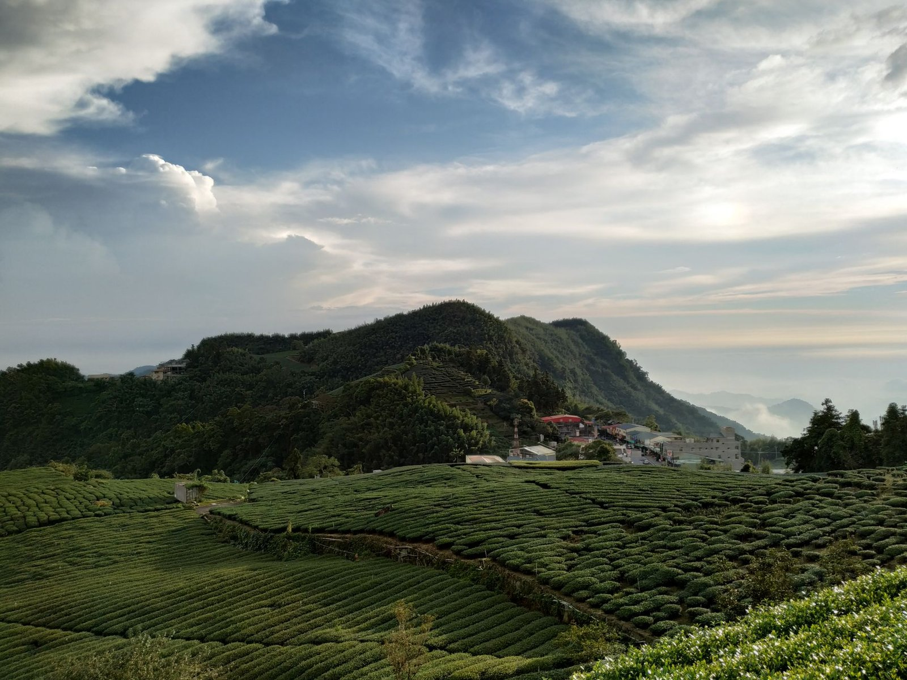

우롱차는 중국 여섯 가지 차 분류법에서 청차(靑茶)로 묶인다. 녹차와 홍차 사이 어딘가에 걸쳐 있다는 뜻에서 흔히 '반발효차'라 불리는데, 이 이름 탓에 다들 산화도가 딱 50% 언저리인 차라고 짐작하기 쉽다.

정말 그럴까. 실은 전혀 그렇지 않다. 산화도가 10%도 안 되는 우롱차가 있는가 하면, 70%를 넘겨 홍차 쪽으로 성큼 다가가 있는 우롱차도 있다.

산화도가 갈리는 지점은 제다 공정 안에 있다. 찻잎을 따서 시들리고(위조), 잎을 흔들어 가장자리에 상처를 내는 요청(摇青)을 거치면서 산화가 서서히 진행되는데, 이 과정을 어느 시점에서 끊느냐가 관건이다. 녹차는 채엽 직후 곧바로 열을 가해 산화 효소를 죽여버리고, 홍차는 산화를 끝까지 밀어붙인 뒤에야 건조에 들어간다. 우롱차는 그 사이 어딘가, 제다사가 정한 타이밍에 살청(殺靑)을 넣어 산화를 멈춘다. 같은 찻잎이라도 이 타이밍이 몇 시간만 달라져도 완전히 다른 차가 나온다.

*둥글게 말려 볶아낸 우롱차 잎 — Photo by Tima Miroshnichenko on Pexels*

대만 문산 지역의 포종차(包種茶)는 산화도가 8%에서 18% 사이로 알려져 있어 우롱차 중에서도 녹차에 가장 가까운 축에 속한다. 아리산이나 리산 같은 고산 지대에서 나는 대만 고산우롱은 대개 20~30%대다. 안계 지역 철관음은 전통 방식으로 만들면 이보다 진하게 볶아내는 경우가 많은데, 최근에는 맑고 향긋한 청향형이 대세가 되면서 산화도를 낮추는 쪽으로 옮겨가는 추세라고 한다.

반대편 끝에는 동방미인(백호오룡)이 있다. 산화도가 60%를 넘어 70% 안팎까지 가기도 하는데, 여기엔 소록엽선(小綠葉蟬)이라는 작은 매미충이 관여한다. 이 벌레가 잎을 물어뜯으면 잎이 방어 반응으로 화학 성분을 바꾸고, 그것이 산화 과정과 맞물려 특유의 꿀향과 과일향을 만든다는 설명이 널리 받아들여지고 있다.

*대만 고산 지대의 우롱차 재배지 — Photo by Shirwan Sany on Pexels*

산화도가 다르면 우려내는 방식도 달라져야 한다. 문산포종처럼 산화도가 낮은 차는 녹차에 가깝게 낮은 온도와 짧은 시간으로 우리는 편이 낫고, 동방미인처럼 산화도가 높은 차는 홍차를 우릴 때와 비슷하게 뜨거운 물을 써도 무난하다. 다만 같은 이름의 차라도 생산자와 그해 기후에 따라 산화도 편차가 크다는 점은 감안해야 한다. 포장지에 적힌 산화도 수치는 참고치일 뿐, 우렸을 때의 실제 맛까지 보장해주지는 않는다.

몇 해 전 타이베이의 한 찻집에서 문산포종과 동방미인을 나란히 우려 마신 적이 있다. 둘 다 우롱차라는 이름표를 달고 있었지만 잔에 담긴 색부터 완전히 달랐다. 하나는 연둣빛, 하나는 짙은 호박색. 같은 범주 안에 이렇게 다른 차들이 섞여 있다는 게 새삼스러웠다.

> "파이프라인 검증용 — 인라인 이미지 복사 확인"
