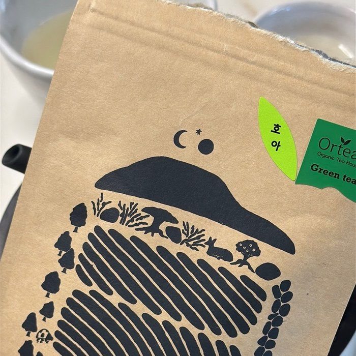
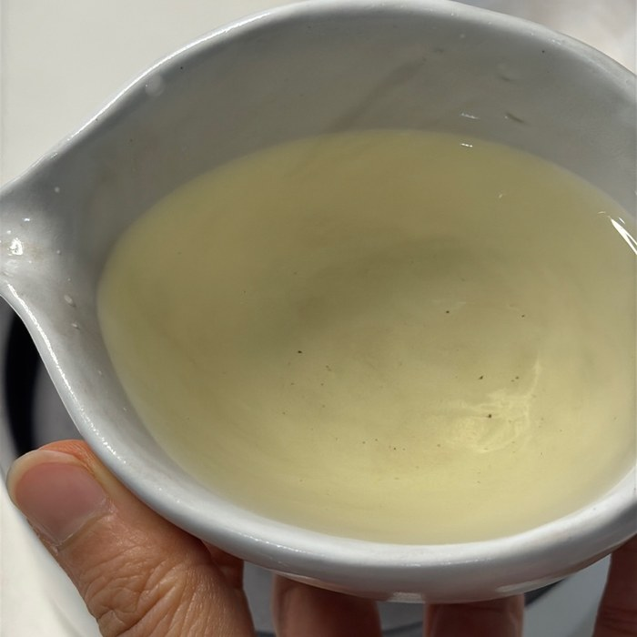
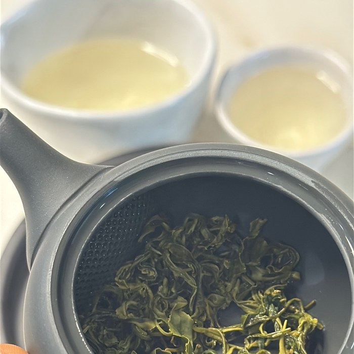

점심을 먹고 나서 내려 마신 차가 하필 녹차였던 이유는 단순해요. 차통에서 제일 먼저 손이 간 게 **올티스 호아 녹차**였거든요. 제주 올티스 다원에 직접 갔을 때 사 온 건데, 그때 다원에서 이른 봄 첫 싹을 한 아(芽)에 두 잎, 그러니까 **1아 2엽**만 골라 손으로 따고 정성껏 덖었다는 설명을 들었어요. 기계로 대량 수확하는 것과는 다르다 보니 찻잎 하나하나가 작고 여린데, 봉투를 열자마자 그 크기 차이가 눈에 들어오더라고요.

패키지 뒷면에는 80℃ 물 300ml에 3분을 우리라고 적혀 있어요. 근데 저는 그 방법을 그대로 따르지 않았습니다. 집에 있는 다관 중에 110ml 정도밖에 안 들어가는 작은 걸 골라서 2.5g을 넣고, 짧게 여러 번 우려 마시는 쪽을 택했거든요. <u>물의 양이 적고 잎의 비중이 높을수록, 한 번에 오래 우리기보다 짧게 여러 번 나눠 우리는 쪽이 맛의 균형을 잡기 쉬워요</u>. 첫탕부터 진하게 다 빼버리면 뒤로 갈수록 밍밍해지는데, 짧게 끊어 우리면 우림마다 비슷한 밀도로 마실 수 있거든요. 3번 정도가 딱 맞고요. 연하게 마시는 걸 좋아한다면 5번까지도 충분히 우려집니다.

탕색은 맑고 연한 녹색이에요. 한 모금 마시면 감칠맛과 신선한 향이 먼저 오고요. 혹시 차 우리기 전에 마른 잎 향부터 맡아보신 적 있으세요? 저는 뜨거운 물 붓기 전에 항상 한 번 맡아보는 편인데, 이번엔 풋풋한 냄새가 벌써 진하더라고요. 우리고 난 뒤 다관 안에 남는 잎, 그러니까 **엽저**를 펼쳐보면 이 차가 왜 손 수확이라는 설명을 들었는지 알 것 같아요. 작고 아기자기한 잎들이 촘촘히 펴지는데, 그 모습이 예뻐서 다관 뚜껑을 자꾸 열어보게 됩니다.

엽저를 그냥 버리기엔 아까워서 저는 나물로 무쳐 먹는 걸 좋아해요. 주먹밥이나 흰밥에 곁들이면 은근히 잘 어울리거든요. 이 얘기는 다음에 따로 써볼게요.
