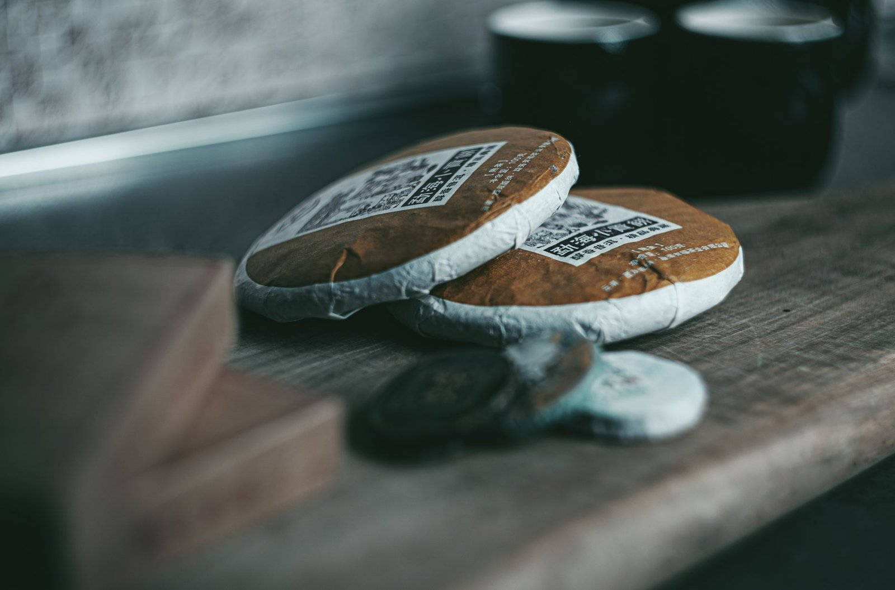

보이차 얘기가 나오면 꼭 따라붙는 말이 있어요. "오래될수록 좋다"는 얘기요. 골동품처럼 묵힐수록 값도 오르고 맛도 좋아진다는 식으로들 이야기하시는데, 정말 그럴까요? 사실 이 말은 절반만 맞아요. 보이차 안에도 완전히 다른 두 종류가 있거든요.

보이차는 크게 **생차**(生茶, shēngchá)와 **숙차**(熟茶, shúchá)로 나뉩니다. 생차는 찻잎을 덖고 비벼서 말린 뒤 둥글게 눌러 압병해요. 그렇게 만든 덩어리를 그대로 두고 시간에 맡겨 천천히 산화·발효되게 놔두는 방식이죠. 반면 숙차는 1970년대 초 윈난(雲南)에서 개발된 것으로 알려진 **악퇴**(渥堆)라는 공정을 거칩니다. 찻잎을 쌓아놓고 물을 뿌려 미생물 발효를 인위적으로 촉진시키는 건데요. 이 과정을 거치면 몇 주에서 몇 달 만에 자연 발효 수십 년 치와 비슷한 발효도가 나온다고 해요.

그러니까 "오래될수록 좋다"는 말은 사실 생차 쪽에 더 가까운 얘기예요. <u>생차는 시간이 지나면서 맛이 계속 변하긴 하지만, 그게 항상 좋은 방향인 건 아니에요.</u> 온도와 습도, 공기 흐름이 어떻게 관리됐느냐에 따라 결과가 완전히 달라지거든요. 습기가 너무 많으면 곰팡이가 슬 수도 있고, 반대로 너무 건조하면 발효가 거의 멈춰서 몇 년이 지나도 풋내가 안 빠지기도 해요. 오래됐다고 다 좋은 보이차는 아니라는 거죠.

*둥글게 압병된 보이차 덩어리 — Photo by Ahimsa -  OM on Pexels*

숙차는 좀 다릅니다. 악퇴 과정에서 발효가 이미 상당 부분 끝난 상태라, 몇 년을 더 묵힌다고 해서 극적으로 맛이 바뀌지는 않거든요. 그래서 숙차는 사놓고 바로 마셔도 크게 부담이 없는 차예요. 다만 이것도 절대적인 얘기는 아니에요. 숙차 안에서도 발효 강도나 원료에 따라 편차가 있어서, 다 똑같다고 단정하긴 어려워요.

다음번에 보이차를 만나면 생차인지 숙차인지 먼저 구분해 보아야 겠어요.
