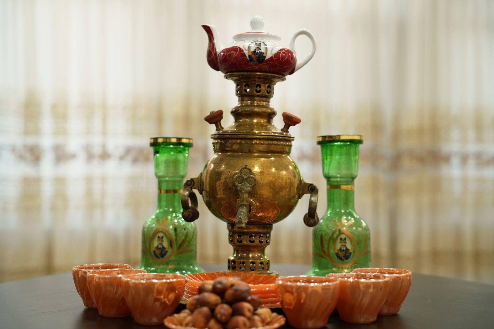

러시아 가정에서 차를 마시는 모습을 본 적 있으신가요? 찻잔에 뜨거운 물을 붓고 티백을 담그는 게 아니라, 진하게 우려낸 홍차 농축액을 잔 바닥에 조금 따른 다음 그 위에 뜨거운 물을 부어 농도를 맞춰 마셔요. 처음 보면 번거로워 보이는데, 러시아에서는 아주 오래전부터 이어져 온 방식이랍니다.

이 농축액을 **자바르카**(заварка)라고 불러요. 작은 찻주전자에 찻잎을 평소보다 훨씬 많이 넣고 진하게 우린 다음, 마실 때마다 각자 취향에 맞게 물을 섞는 거예요. 그리고 그 물을 데우는 도구가 바로 **사모바르**(самовар)입니다. 금속으로 만든 큰 물주전자인데, 가운데 관을 따라 숯이나 전기로 물을 계속 끓여주는 구조예요. 사모바르 생산지로 유명한 도시가 툴라(Tula)인데, 지금도 러시아를 상징하는 공예품으로 꼽혀요.

*러시아 가정에서 오래 쓰인 사모바르, 찻물을 끓이고 데우는 도구예요 — Photo by AmirHadi Manavi Moghadam on Pexels*

설탕을 다루는 방식도 독특해요. 잔에 설탕을 넣어 녹이는 대신, 각설탕 한 조각을 입에 물고 그 사이로 차를 마시는 **브프리쿠스쿠**(вприкуску)라는 방식이 전해지거든요. 설탕이 귀하던 시절의 습관이 남은 거라는 이야기가 있는데, 정확한 기원은 확실하지 않아요. 잼을 곁들이는 것도 비슷한 맥락인데요, 러시아 문학 속 다과 장면에도 종종 등장하는 바레니예(варенье, 러시아식 잼)를 차와 함께 숟가락으로 떠먹거나 살짝 섞어 마시기도 해요.

*레몬을 띄운 홍차는 서구에서 종종 '러시아식 티'로 불려요 — Photo by Dana Ciurumelea on Pexels*

요즘 러시아 가정에서도 전기 주전자를 더 자주 쓰긴 하지만, 명절이나 손님이 올 때는 여전히 사모바르를 꺼내는 집들이 있다고 해요. 레몬을 띄운 홍차가 서구에서 '러시아식 티'로 불리게 된 유래에 대해서는 여러 설이 있지만 어느 쪽도 확실히 입증되진 않았고요. 차 한 잔에도 이렇게 여러 겹의 이야기가 쌓여 있다는 게, 알고 보면 꽤 재미있죠.
