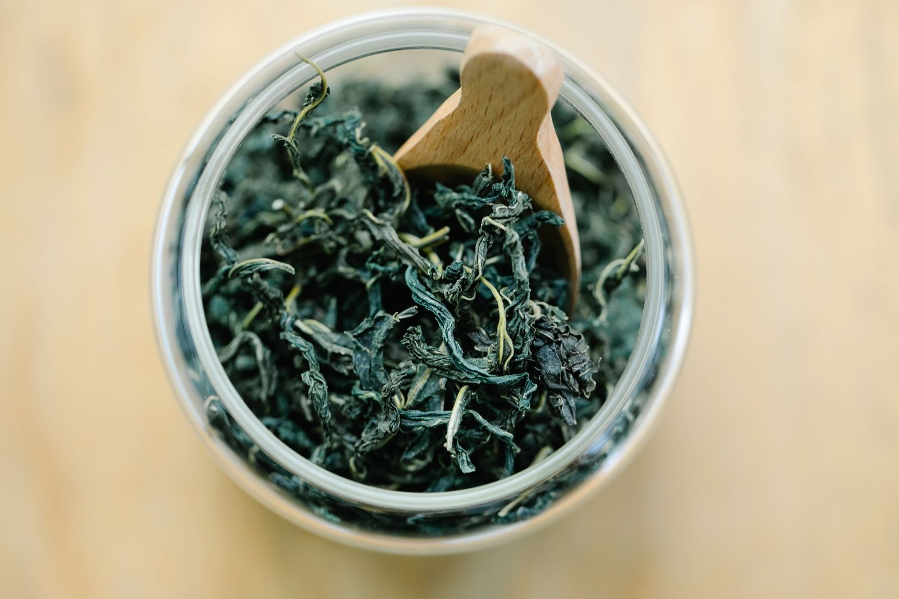

영어로는 티(tea), 프랑스어로는 테(thé)인데, 러시아어로 가면 갑자기 차이(chai)가 되고 아랍어에서는 샤이(shay), 튀르키예어에서는 차이(çay)가 되죠. 신기하게도 이 세상의 '차'라는 단어는 딱 두 갈래로만 갈리는데요, 우연이라고 보기엔 너무 깔끔하게 나뉘어 있어요. 왜 이렇게 됐을까, 궁금하지 않으세요?

이유는 의외로 단순해요. **차**(茶)라는 한자를 중국 안에서도 지역마다 다르게 읽었거든요. 표준중국어(만다린)로는 '차(chá)'에 가깝게 읽지만, 푸젠성 남부 사투리인 민난어(Min Nan)로는 '테(te)'에 가깝게 발음해요. 그런데 17세기 무렵 네덜란드 동인도회사가 차를 유럽으로 실어 나른 항구가 하필 푸젠 지역의 아모이(현재 샤먼)였어요. 그래서 바닷길을 따라 유럽으로 퍼진 말은 **테 계열**이 됐고, 여기서 tea, thé, Tee, tè 같은 이름들이 갈라져 나왔죠.

*옛날 푸젠 항구에서 배에 실려 유럽으로 건너가던 찻잎을 상상해봐요 — Photo by Anna Pou on Pexels*

반대로 육로, 그러니까 실크로드를 따라 중앙아시아·페르시아·러시아 쪽으로 퍼진 차는 만다린이나 광둥어 발음에 가까운 **차 계열**을 그대로 물려받았어요. 페르시아어 차이(chāy)를 거쳐 러시아어 차이, 힌디어·우르두어 차이, 튀르키예어 차이, 아랍어 샤이까지 — <u>육로를 탄 말은 거의 다 '차' 계열</u>이라고 보시면 얼추 맞아요. 인도의 그 유명한 짜이(chai tea)도 결국 '차'라는 말 자체에 이미 '차'가 들어있는 셈이라, 엄밀히 말하면 '짜이 티'는 약간 겹말이기도 해요.

물론 깔끔하게 두 갈래로만 떨어지진 않아요. 포르투갈어는 대표적인 예외인데요, 포르투갈도 분명 배를 타고 아시아와 교역했는데 단어는 샤(chá)예요. 포르투갈 상인들이 푸젠이 아니라 광둥·마카오 쪽 항로로 차를 들여왔기 때문이라는 설명이 일반적이지만, 세부적인 무역로나 시기에 대해서는 언어학자들 사이에서도 완전히 의견이 같지는 않아요. 폴란드어 '헤르바타(herbata)'처럼 아예 다른 계열(라틴어로 '약초'를 뜻하는 herba에서 온 말)도 있고요.

이 얘기를 알고 나면 차 상자에 적힌 이름들이 조금 다르게 보이긴 해요. 다음에 외국 마트에서 티백 상자를 볼 일이 있으면 포장지에 적힌 이름이 '테' 계열인지 '차' 계열인지 한번 확인해보세요. 그 나라가 차를 어느 무역로로 처음 만났는지, 이름 하나에 힌트가 남아있는 셈이니까요.
