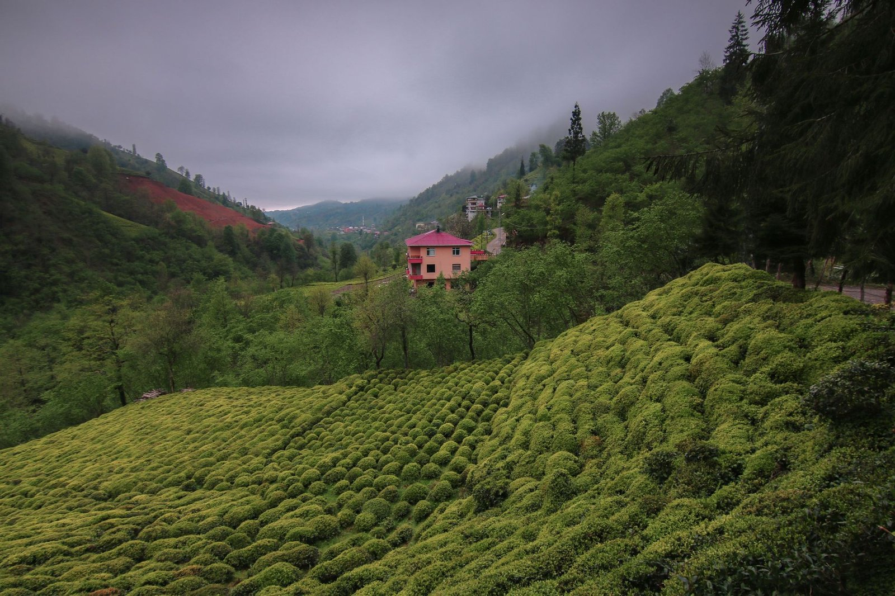
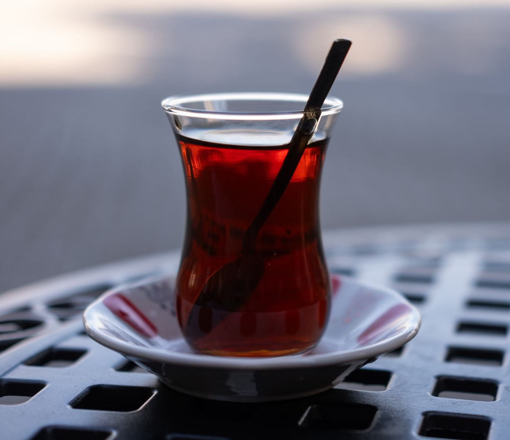

튀르키예 하면 진한 커피부터 떠올리는 분들 많으실 거예요. 튀르키예식 커피(Türk kahvesi)는 유네스코 인류무형문화유산에도 등재되어 있으니까요. 그런데 정작 튀르키예 사람들이 하루에도 몇 잔씩 마시는 건 커피가 아니라 **차이**(çay)예요. 정확한 수치는 조사기관마다 다르지만, 튀르키예의 1인당 차 소비량이 세계에서 손꼽히는 수준이라는 결과가 여러 차례 나온 적이 있거든요. <u>커피의 나라로 알려진 것과 실제 일상은 꽤 다르다</u>는 얘기죠.

이 차이 대부분은 튀르키예 북동쪽, 흑해 연안의 **리제**(Rize)라는 지역에서 자라요. 안개가 잦고 강수량이 많은 이 지역 기후가 차나무 재배에 잘 맞았다고 하는데요, 튀르키예에서 본격적으로 차를 재배하기 시작한 건 20세기 들어서였다는 설이 있어요. 원래는 커피를 수입에 의존하던 나라였는데, 국내에서 기를 수 있는 작물을 찾다가 조지아(그루지야) 접경 지역의 재배 경험을 참고했다는 이야기가 전해집니다.

확실한 창시자나 연도까지는 자료마다 조금씩 엇갈려서, 여기서 단정하긴 어려워요.

*안개 낀 흑해 연안의 차밭 풍경 — Photo by Orhan Namlı on Pexels*

우려내는 방식도 눈에 띄어요. 튀르키예 가정과 찻집에는 위아래로 포개진 **이중 주전자**(çaydanlık)가 흔한데요, 아래쪽 주전자에서 물을 끓이고 그 김으로 위쪽 주전자의 찻잎을 진하게 우려내는 구조예요. 이렇게 만든 진한 원액을 잔에 조금 따른 뒤, 아래 주전자의 뜨거운 물을 부어 농도를 맞추는 식이죠. 진하게(koyu) 드실지 연하게(açık) 드실지, 고르라면 어느 쪽이세요? 순전히 개인 취향이라 찻집에서 이 표현으로 취향을 말하면 알아서 맞춰주기도 해요. 우유를 타는 영국식과 달리 대개 그냥 마시고요.

*튤립 모양의 얇은 유리잔에 담긴 튀르키예식 차 — Photo by Doğan Alpaslan  Demir on Pexels*

잔 모양도 그냥 나온 게 아니에요. 허리가 잘록한 튤립 모양 유리잔(ince belli bardak)은 아랫부분은 뜨거운 차를 오래 유지하고 입이 닿는 윗부분은 상대적으로 빨리 식게 만들어서, 데지 않고 마실 수 있게 설계됐다는 설명이 흔해요. 각설탕을 곁들여 내는 것도 특징인데, 저어 마시기보다 입에 물고 차를 마시는 사람들도 있다고 하고요. 이스탄불 시장이든 이발소든 어디를 가도 차 권하는 손길을 마주치게 되는데, 이건 손님 접대의 기본 예절에 가까워서 거절하기가 살짝 애매한 상황이 생기기도 한다더군요.
