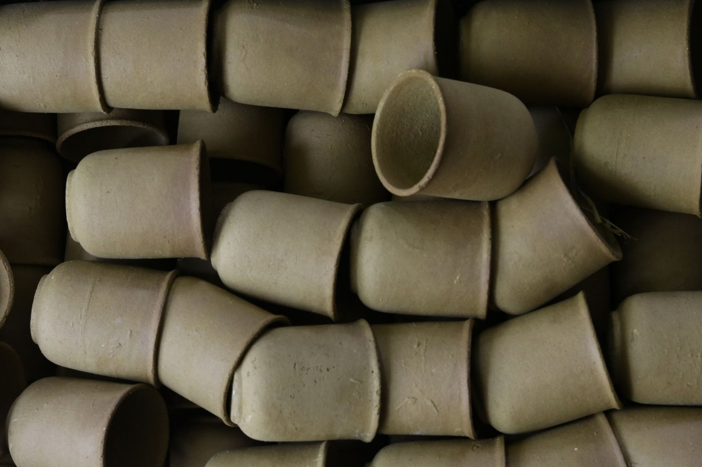

선물로 자사호를 받으면 처음엔 다들 비슷한 실수를 해요. 새 그릇이니까 당연히 주방세제 풀어서 스펀지로 뽀득뽀득 닦는 거죠. 그런데 자사호를 오래 써온 분들한테 이 얘기를 하면 살짝 놀라는 표정을 지으실 거예요. <u>자사호는 세제로 씻지 않는 게 원칙이거든요.</u>

자사호(紫沙壺)는 중국 장쑤성 이싱(宜興)에서 나는 점토로 빚은 찻주전자예요. 이름의 '자사(紫沙)'는 '자줏빛 모래'라는 뜻인데, 실제로는 자줏빛뿐 아니라 붉은빛이 도는 주니(朱泥), 노란빛이 도는 단니(段泥) 등 색이 꽤 다양합니다. 이싱 도자기가 언제부터 찻주전자로 만들어졌는지는 명나라 시기부터라는 게 대체로 통용되는 설명이지만, 그 이전 기원에 대해서는 전설처럼 전해지는 이야기가 많아서 확실하다고 단정하긴 어려워요.

자사호의 가장 큰 특징은 **유약을 입히지 않는다**는 점이에요. 겉보기엔 매끈해 보여도 표면에 눈에 안 보이는 미세한 기공이 있거든요. 이 기공이 차를 우릴 때 나오는 미세한 기름 성분과 향을 서서히 흡수합니다. 그래서 세제를 쓰면 그 세제 성분까지 기공 속으로 스며들 수 있어요. 한번 배어들면 잘 안 빠지고요. 이싱차호를 다루는 사람들 사이에서 뜨거운 물로만 헹구고 부드러운 천으로 닦아내는 게 기본 관리법으로 통하는 이유가 여기에 있어요.

*유약을 입히지 않은 자사호 표면에는 미세한 기공이 있어요 — Photo by Anubhaw Anand on Pexels*

이 기공 때문에 생기는 또 하나의 관습이 **일호일차**(一壺一茶)예요. 자사호 하나에는 한 가지 종류의 차만 우리라는 뜻이죠. 보이차를 우리던 호에 녹차를 우리면 기공에 남아있던 보이차 향이 섞여 나올 수 있거든요. 오래 길들인 자사호는 물만 부어도 은은하게 차향이 난다는 이야기도 있는데, 이건 사용자들 사이에서 전해지는 경험담에 가깝고 어느 정도인지 정량적으로 검증된 얘기는 아니에요. 이렇게 오래 써서 광택과 향이 배는 과정을 '양호(養壺)', 우리말로 풀면 '호를 기른다'고 표현합니다.

다만 이 규칙이 모든 다구에 적용되는 건 아니에요. 유약을 바른 자기 찻주전자나 유리 다관, 개완(蓋碗)은 표면이 매끈하게 밀봉돼 있어서 세제로 씻어도 무방합니다. 물론 자사호를 무조건 안 씻는 게 좋다는 뜻도 아니고요. 오래 방치하거나 습한 곳에 두면 오히려 곰팡이나 잡내가 생길 위험이 있다는 지적도 있어서, 매번 사용 후엔 반드시 뜨거운 물로 헹구고 완전히 말려서 보관하는 게 중요하다고 하네요. 향 기른다고 위생까지 포기하면 곤란하겠죠.
